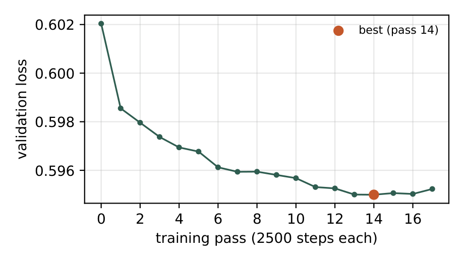
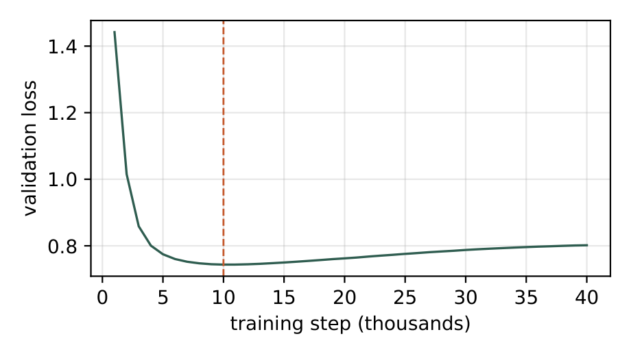

# 古琴生成实验 · Adapting a Latent Audio Diffusion Model to Historical Guqin Recordings

用 **Stable Audio 3 Medium + rank-16 DoRA 适配器**，在 42.5 小时筛选过的历史古琴独奏录音上做**音频续写**和**场景文字生成**，目标是一台能一直放下去的"古琴 AI 电台"。七轮盲听评估（单一专业听者）决定了每一步设计。

- 预印本：[arXiv:2610.07486](https://arxiv.org/abs/2610.07486) · 仓库内 PDF：[`paper/tismir/arxiv.pdf`](paper/tismir/arxiv.pdf)
- 论文对应代码标签 `arxiv-v1`；结果冻结于 `freeze-2026-10-05`（[`paper/FREEZE.json`](paper/FREEZE.json) 记录所用检查点的 SHA-256）
- 本仓库只跟踪代码、实验记录、评分和小型元数据；音频、潜表示、模型检查点和上游代码都不入库（见 [数据](#数据)）

## 结果一览

最终模型是 370 首录音训练到第 14 遍的适配器（每遍 2500 步 ≈ 一个 epoch）。

| 任务（R7 终评） | 最终适配器 pass 14 | 对照 |
|---|---|---|
| 续写 8 段**未见过**的验证集曲目开头 | **3.88 / 5** | 3.38（此前最佳适配器 C）· 2.75（同一轮 pass 2） |
| 按 5 条训练后新写的场景描述直接生成 | **4.60 / 5** | 3.60（pass 2） |
| "拉锯/金属噪声"标签数 | 0 | pass 2：3 |

| 系统指标（RTX 5070 Ti 16 GB） | 数值 |
|---|---|
| 训练 | 45.9 min / 遍，17 遍共 13 h |
| 验证损失（276 个保留窗 × 5 个固定噪声水平） | 0.6020（未适配）→ 0.5950（pass 14） |
| 文字生成 35 s 音频 | 4.1 s（8.6 倍实时） |
| 10 s 开头续写 25 s | 6.0 s，峰值显存 6.5 GB |

<p align="center">
  
  
</p>

左：最终训练轮每遍的验证损失，橙点为最低的第 14 遍。右：从零训练的潜空间语言模型基线，1 万步后开始过拟合。两张图由 `python paper/analysis.py` 从仓库内的日志重新生成。

### 七轮试听（评分 1–5）

| 轮次 | 问题 | 条件 | n | 均分 |
|---|---|---|---|---|
| R1 掩码 | 续写加权掩码有用吗 | 默认掩码 (10/80/10) / 续写掩码 (10/30/60) / 412 首 + 续写掩码 | 8 | 2.88 / 2.62 / 3.38 |
| R2 推理 | 适配器强度、步数 | 强度 1.0 / 0.7 / 仅早期步 · base 模型 50 步 / 222 段旧适配器 | 9–10 | 3.56 / 3.60 / 3.67 · 2.70 / 3.10 |
| R3 字幕 | 文字条件有用吗 | 续写：无文字训练 / 无提示 / 匹配标签 / 相反标签 · 纯文字：无 / 有标签训练 | 9 · 5 | 3.89 / 3.56 / 4.00 / 4.00 · 2.00 / 3.80 |
| R4 基线 | 从零训练行不行 | 潜空间 LM / SA3 适配器 | 11 / 6 | **1.00** / 2.00 |
| R5 训练长度 | 多训几遍、加调式 | 1 遍 / 3 遍 + 标签 / 3 遍 + 标签 + 调式 | 8 | 3.75 / 3.75 / 4.12 |
| R6 故事字幕 | 曲目典故能否帮忙 | pass 2 / 适配器 C | 7 / 8 | 3.00 / 3.50 |
| R7 终评 | 最终模型 | 续写：pass 14 / pass 2 / C · 场景：pass 14 / pass 2 | 8 · 5 | **3.88** / 2.75 / 3.38 · **4.60** / 3.60 |

**负面结果同样重要**：从零训练的 72M 潜空间语言模型完全没有古琴音色（11 段全部最低分）；"摩擦噪声帧占比"与听者的"拉锯"抱怨方向相反（Spearman ρ = +0.39）；五声音阶拟合度在全体 124 段上与评分相关（ρ = 0.52），但同一开头的候选之间几乎无区分力（ρ = 0.31）。链式续写做长时播放时暴露了每段末尾 0.5 s 的数字静音和逐段变响的响度反馈，各用几行信号处理修掉。评分来自一位听者、每条件至多十段，所有配对差异都不显著，细节见论文。

## 示例

**场景描述 → 35 s 古琴**（`outputs/古琴展示v1/样本记录.json` 中的一条提示）：

> Solo guqin, Chinese seven-string zither. Rain on a mountain hut at night; a lone lamp, incense, a hermit sitting alone listening to the rain. 山居夜雨，孤灯焚香，独坐听雨。

**10 s 录音开头 → 续写 25 s**：开头取自比较的所有模型都没训练过的曲目（例如 `outputs/古琴试听台/试听说明.json` 用的是训练集之外的《平沙落雁》片段），同一开头、同一随机种子的候选打乱后匿名呈现给听者。

每一轮试听页都在 `outputs/<实验名>/index.html`，旁边的 `*.json` 记录样本来源、提示词和种子；听者的原始评分在 [`paper/data/ratings/`](paper/data/ratings)。页面里引用的音频不入库，所以克隆后页面只剩文字记录。

## 数据

| | 数量 |
|---|---|
| 整曲试听筛选前的候选录音 | 638 |
| 保留的独奏录音 | **412 首 · 61 位演奏者 · 42.5 h · 108 个曲名** |
| 按曲目随机分组（训练 / 验证 / 测试） | 329 / 42 / 41 首 |
| 59.9 s 对齐窗（2,641,920 采样点） | 2,764（去掉 9 个数字静音窗） |
| 最终训练集 | 训练 + 测试 370 首，验证集留作早停和试听 |

仓库里有的：
- [`work/guqin_aligned_412/manifest.csv`](work/guqin_aligned_412/manifest.csv) 分窗清单与分组、`window_modes.json` 每窗估计的五声调式、`window_noise.csv` 噪声扫描、`eval_contexts/index.json` 试听用的开头片段来源
- `outputs/古琴整曲筛选/` 整曲筛选记录与按曲目分组表，`outputs/古琴录音筛选/`、`outputs/古琴素材审听/` 听审反馈
- [`paper/data/`](paper/data) 评分、验证损失日志、计时数据；[`paper/generated/numbers.json`](paper/generated/numbers.json) 论文里的全部数字

不入库的：原始录音（个人收藏的历史演奏，仍在版权期内）、SAME-L 潜表示、适配器权重、生成音频。基础模型按 Stability AI 社区许可使用。

## 方法要点

- **适配**：在非蒸馏的 base 模型上训练 DoRA（r = α = 16，21.6M 可训练参数），推理时套在 8 步蒸馏模型上
- **掩码**：随机片段 / 全掩 / 给定前缀的比例从默认 (0.1, 0.8, 0.1) 改为 (0.1, 0.3, 0.6)，让大多数训练样本像续写
- **字幕**：每首曲子的典故叙述 + 37 个情绪 / 场景标签中的 2–5 个 + 每窗自动估计的五声调式；三种字幕风格按稳定哈希分配，10% 置空
- **裁剪与早停**：每个样本随机取 20 s 以上的片段，其余填静音潜表示；连续 3 遍验证损失没有新低就停
- **长时播放**：每段从前 15 s 上下文续 30 s，多生成 3 s 以切掉静音尾巴，上下文固定在 −16 dBFS 送入、输出按上下文 RMS 回配，0.1 s 交叉淡入
- **基线**：8 层 512 宽的因果 transformer + flow-matching 头，逐帧预测 256 维潜表示（72M 参数，1.42M 帧）

## 复现

脚本都在 `work/`，用 `work/stable-audio-3/.venv` 的 Python 运行；原始录音路径在各脚本顶部（默认 `Y:\Music\古琴曲`）。

```bash
# 1. 整曲筛选结果 → 412 首对齐分窗（manifest.csv、音频窗）
python work/build_guqin_aligned_corpus.py

# 2. 字幕：典故 + 标签 + 调式，写入训练 / 验证潜表示目录
python work/build_guqin_story_captions.py --splits train test --target <latents_dir>

# 3. 逐遍训练到过拟合（DoRA r=16，每遍 2500 步，连续 3 遍无新低即停）
python work/run_guqin_until_overfit.py --steps_per_pass 2500 --patience 3

# 4. 生成试听样本：8 段未见开头的续写 + 场景描述纯文字生成
python work/generate_guqin_story_eval.py

# 5. 长时播放：链式续写 + 静音尾裁剪 + 响度锁定
python work/generate_guqin_pass14_expand.py

# 6. 试听页（打乱、匿名、评分后才揭示对应关系）
python work/build_guqin_pass_compare_page.py

# 7. 论文里的全部数字和图
python paper/analysis.py
```

基线潜空间语言模型：`work/train_guqin_latent_lm.py` 训练、`work/generate_guqin_latent_lm.py` 生成。自动指标：`work/guqin_pitch_metric.py`（五声拟合与起音音高）、`work/guqin_noise_features.py`（噪声帧占比）。

## 目录

- `work/*.py` — 数据筛选、分窗、编码、训练、生成、评估脚本
- `work/guqin_aligned_412/` — 412 首整曲的分窗清单、分组、调式与噪声扫描结果
- `outputs/*/` — 各轮试听页 `index.html`、实验记录和样本记录
- `paper/` — 论文源码（`tismir/`）、冻结的数据（`data/`）、生成的数字与图（`generated/`）、[`paper/README.md`](paper/README.md) 说明编译与复现

## 未入库的依赖（`work/` 下的上游克隆，均未修改）

| 目录 | 来源 | commit |
|---|---|---|
| `stable-audio-3` | https://github.com/Stability-AI/stable-audio-3 | `7f3a3a0` |
| `ACE-Step-1.5` | https://github.com/ace-step/ACE-Step-1.5 | `ca1e85f` |
| `magenta-realtime-torch` | https://github.com/multimodalart/magenta-realtime-torch | `6d076ba` |

## 引用

```bibtex
@article{cai2026guqin,
  title   = {Adapting a Latent Audio Diffusion Model to Historical Guqin Recordings: A Listening-Driven Case Study},
  author  = {Cai, Huanchen},
  journal = {arXiv preprint arXiv:2610.07486},
  year    = {2026}
}
```
